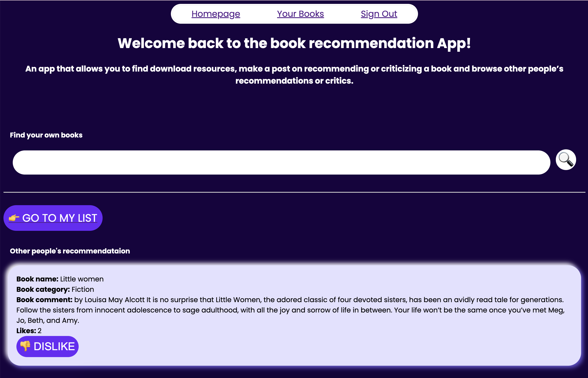
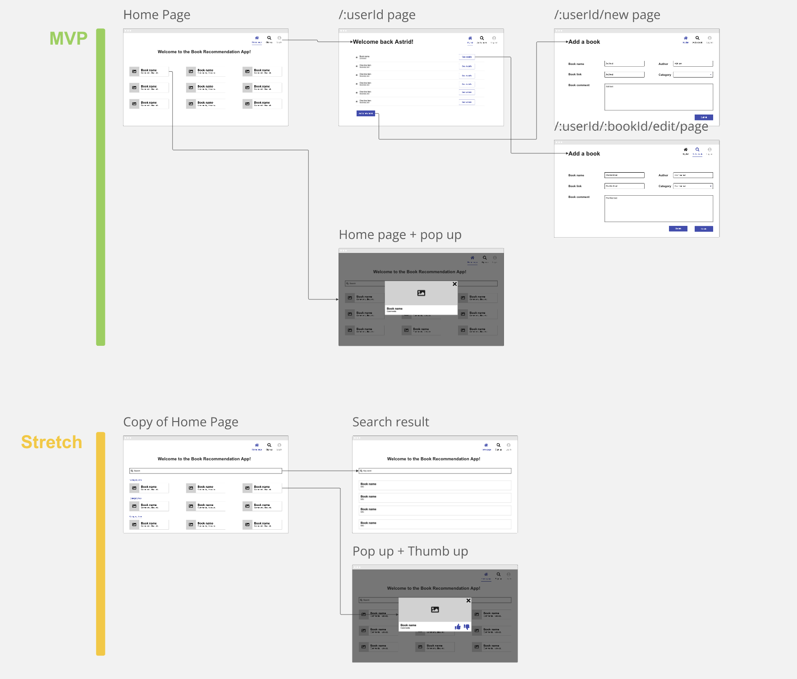
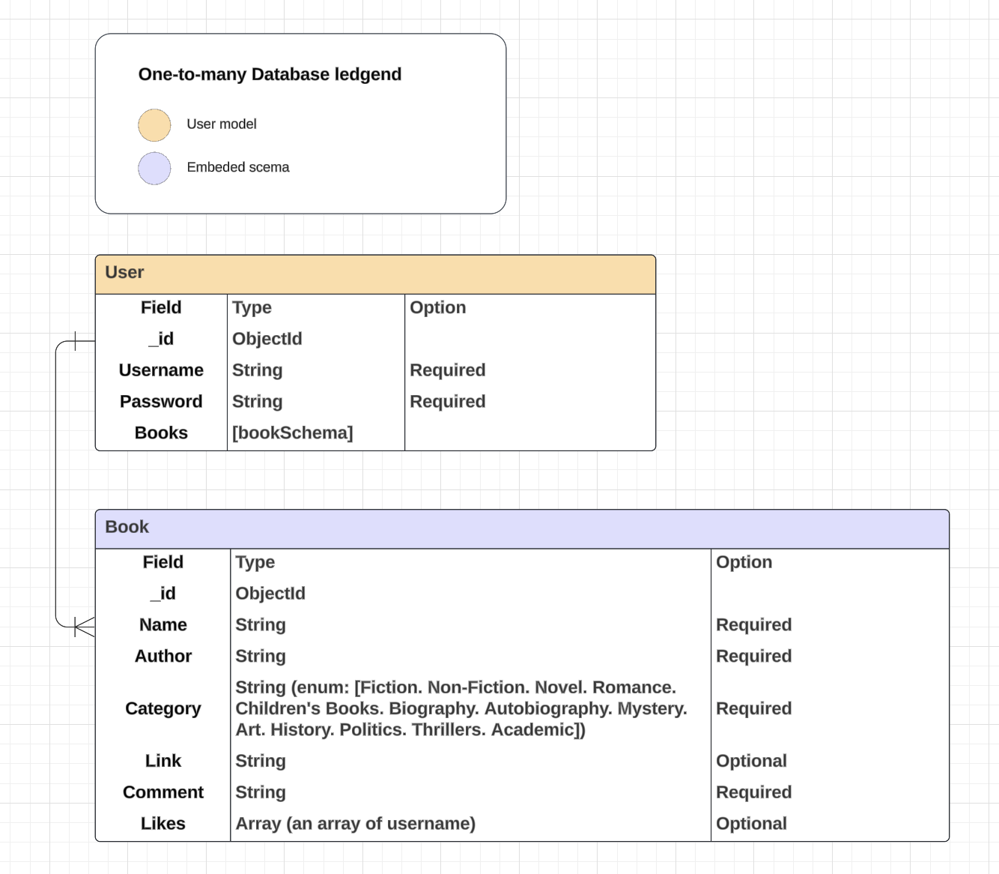

# App Introduction - Book Recommendation App

### Project Choice: 
Book Recommendation App

### Project Inspriation: 
As a user, I always have trouble with finding good books and the pdf resources for the boooks I'm interested. So I decided to developed an app for myself. This app will provided pdf resources based on keyword searching. It will also share other people's recommendations on books as well as making your own booklist.

### Project Description:
An app that allows you to find download resources, make a post on recommending or criticizing a book and browse other people’s recommendations or critics.

### Key Features:
#### Search:
This app will allow gest or AUU users input keywords and the return a list of books'name contains the keywords. For each book, we wll have **Name, Author, Publish date, Category, Description**, and most importantly **PDF link** provided for users.

#### Make post:
This app will also allow gest or AUU users to browse other people's posts, and will allow AUU users to make a booklist saved at their account and posted to the public. So that they can have access to their own booklist as well as see other people's recommendations. They can thumb-up or thumb-down on pther people's posts if they want.

### Getting Started: 
* [Deployed Link](https://book-recommendation-app-9b527a62da74.herokuapp.com/)
* [Trello Link](https://trello.com/invite/b/66fa05473801894d4894a518/ATTIcce3af9fe7775eb69a407a85b5e96d3175AC10A1/unit2-book-recommendation-app)

### User Stories:
* ✅ As a guest user or AUU, I want to browse other people’s recommendations on books including the rating/comments etc. So that I can get some recommendations from other people when I don’t know what to read.
* ✅ As a guest user I want to be able to sign up so that I can log in the app and make my own post in the future.
* ✅ As an AUU, I want to be able to add a new post about a book I want to recommend.
* ✅ As an AUU, I want to save the book name, author, book category, my rating on the book, and comments I have for the book for each post I make.
* ✅ As an AUU, I want to be able to see all of my book recommendation posts as a list.
* ✅ As an AUU, I want to be able to edit my previous book recommendation post.
* ✅ As an AUU, I want to be able to delete any of my previous book recommendation posts.
* ✅ As an AUU, I want to be able to thumb up other people’s posts/recommendations.
* ✅ As a guest user or AUU, I want to search for some key words and the App will recommend books that contain the keyword. (not necessarily from other people’s posts, pull from third-party API)

### Low-fi wireframe:

### Date model:

### Next step:
* Based on the data model we designed and the data we collect from users. Net step, we can do a "Filter feature" based on book category, so that users will be abe to scan the information more easily. 
* We can also use the number of likes to do a ratng system (although, this may change require small change on data model)

### Technologies Used: 
* JavaScript 
* HTML 
* CSS
* Figma

### Links & Attributions:
* [Repo Link](https://github.com/Q-TT/unit2-book-recommendation-App.git)
* [Wire Frames](https://miro.com/welcomeonboard/WnlJQzc4MHlEUThFYnplcWtTOUJpdWgzNE5TZFFnU29VVjB6QWZMMnY2dkpJSFgzOWlWdmZSczVjOG93WlhSeXwzMDc0NDU3MzU0MDExMzA4ODYwfDI=?share_link_id=414046506403)
* [ERD](https://lucid.app/lucidchart/17597ce9-56f3-409f-8b68-1943d82b725a/edit?viewport_loc=199%2C-211%2C2401%2C1307%2C0_0&invitationId=inv_f1b4ee22-77ae-404e-b7ce-61efe1ac0d05)
